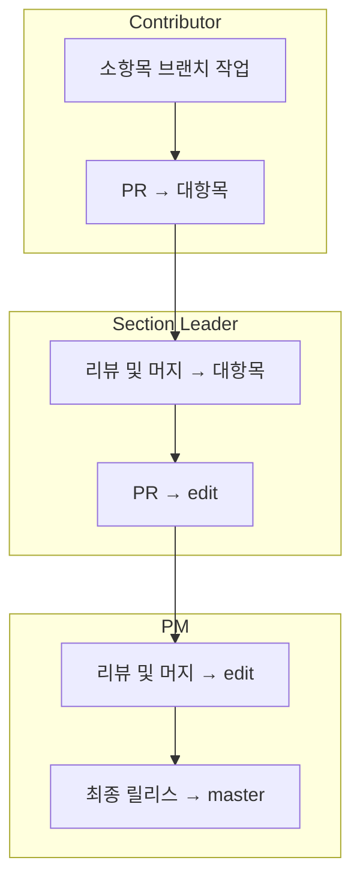

# Pull Request 협업 가이드

> **목적**: 안정적인 버전 관리와 팀원 간 역할 분담을 통해 체계적인 콘텐츠 개발 및 리뷰 프로세스를 운영하기 위함.

---

## 1. 브랜치 전략

브랜치는 다음과 같이 구성된다. :

| 브랜치 이름             | 역할 설명                                       |
|--------------------------|-------------------------------------------------|
| `master`                | 최종 배포본 (책 출판/릴리스 목적)                |
| `edit`                  | PM이 관리하는 편집본. 대항목 단위의 머지 대상     |
| `대항목`                | 각 팀 리더가 관리하는 상위 구조별 브랜치         |
| `대항목/소항목_이름`    | 각 팀원이 작업하는 실질적인 작업 브랜치         |

예시:
- `Heap/Min_heap_Jungle`
- `Binery_search/Binery_search_Jungle`
- `Memory/Virtual_memory_Jungle`

---

## 2. 작업 및 PR 흐름

1. **팀원 작업 단계**
   - 자신의 `대항목/소항목_이름` 브랜치에서 작업을 수행한다.
   - 작업 완료 후 `대항목` 브랜치로 **Pull Request 생성**한다.
   - PR 제목 및 커밋 메시지 규칙은 아래 참고한다.

2. **팀 리더 리뷰 및 병합**
   - 소항목 PR을 검토 후 `대항목` 브랜치에 병합한다.
   - 이후 `edit` 브랜치로 **PR 생성** (총괄 PM 대상)

3. **PM Merge**
   - 모든 대항목 단위 PR을 리뷰 후 `edit` 브랜치에 병합한다.
   - 출판 전 최종적으로 `edit → master`로 병합 진행한다.

---

## 3. 브랜치 이름 규칙

- 형식: `대항목/소항목_이름`
- 예시:
  - `Heap/Min_heap_Jungle`
  - `Binery_search/Binery_search_Jungle`

---

## 4. PR 제목 규칙

- `[대항목] 소항목 작업자명 - 간단한 내용`
- 예시:
  - `Heap/Min_heap_Jungle - 최소 힙 설명 초안 작성`

---

## 5. 커밋 메시지 규칙

- 커밋 메시지는 **의미 단위로 자주 작성**한다.
- 형식 예시:
  - `Add: [내용] 개념 초안`
  - `Fix: 오탈자 수정`
  - `Docs: 문체 가이드 적용`
  - `Review: 챕터리더 or 관리자의 의견 반영`
  
---

## 6. 주의사항

- `master`, `edit`, `대항목` 브랜치에서 직접 작업 금지한다.
- 머지는 모두 **PR 승인 후 수행**한다.
- 리뷰는 반드시 **최소 1인 이상** 승인 후 병합한다.
- 팀원은 작업 전 반드시 `pull`로 최신 내용을 반영한다.
